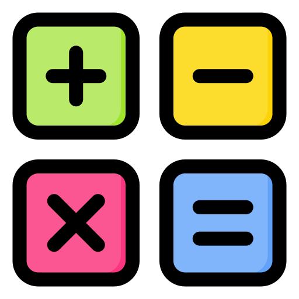

[](https://app.netlify.com/sites/notation-visualizer/deploys)

<p align="center">
  <a href="https://github.com/AjayLiu/notation-visualizer">
    
  </a>
  <h3 align="center">Notation Visualizer</h3>
  <p align="center">
    Visualize how infix/prefix/postfix notation is evaluated with trees and stacks in an interactive website!
    <br />
    <a href="http://notation-visualizer.ajayliu.com/"><strong>Website »</strong></a>
</p>

<!-- TABLE OF CONTENTS -->
<details open="open">
  <summary>Table of Contents</summary>
  <ol>
    <li>
      <a href="#about-the-project">About The Project</a>
      <ul>
        <li><a href="#built-with">Built With</a></li>
      </ul>
    </li>
    <li>
      <a href="#getting-started">Getting Started</a>
      <ul>
        <li><a href="#prerequisites">Prerequisites</a></li>
        <li><a href="#installation">Installation</a></li>
        <li><a href="#development">Development</a></li>
        <li><a href="#deployment">Deployment</a></li>
      </ul>
    </li>
    <li><a href="#contributing">Contributing</a></li>
    <li><a href="#license">License</a></li>
    <li><a href="#contact">Contact</a></li>
    <li><a href="#acknowledgements">Acknowledgements</a></li>
  </ol>
</details>

<!-- ABOUT THE PROJECT -->

## About The Project
</img>

I learned about infix/prefix/postfix notation during my senior year of high school and I find it fascinating that you can evaluate them using both trees and stacks! It's a great way to learn about inorder/preorder/postorder traversal and basic computer science! This website contains two interactive visualizers: a Tree Visualizer and a Stack Visualizer. 

### Built With

-   [Next.js](https://nextjs.org/)
-   [React](https://reactjs.org/)
-   [TailwindCSS](https://tailwindcss.com/)
-   [Netlify](https://www.netlify.com/)

<!-- GETTING STARTED -->

## Getting Started

Here is a guide if you want to clone this template and modify it for yourself, all the way to deployment.

### Prerequisites

-   [yarn](https://yarnpkg.com/)
-   [git](https://git-scm.com/)

### Installation

1. Clone the repo
    ```sh
    git clone https://github.com/AjayLiu/notation-visualizer.git
    ```
2. Install packages
    ```sh
    yarn
    ```

### Development

To run the development server

```sh
yarn dev
```

Then head over to localhost:3000

### Deployment

1. Publish the site on Netlify using continuous git integration. :tada:

<!-- CONTRIBUTING -->

## Contributing

### Issues

Feel free to submit issues and enhancement requests. Also, submit an issue before submitting pull requests. Look through existing issues and see if you want to help out!

### Workflow

Please refer to each project's style and contribution guidelines for submitting patches and additions. In general, we follow the "fork-and-pull" Git workflow.

 1. **Fork** the repo on GitHub
 2. **Clone** the project to your own machine
 3. **Commit** changes to your own branch
 4. **Push** your work back up to your fork
 5. Submit a **Pull request** so that we can review your changes

NOTE: Be sure to merge the latest from "upstream" before making a pull request!

<!-- LICENSE -->

## License

Distributed under the MIT License. See `LICENSE` for more information.

<!-- CONTACT -->

## Contact

Ajay Liu - contact@ajayliu.com

Project Link: [https://github.com/AjayLiu/notation-visualizer](https://github.com/AjayLiu/notation-visualizer)

<!-- ACKNOWLEDGEMENTS -->

## Acknowledgements
- [UCSB Professor Michael Costanzo's pseudocode for evaluating expressions and expression trees](https://sites.cs.ucsb.edu/~mikec/cs12/slides/week08c.pdf)
- [react-d3-tree](https://github.com/bkrem/react-d3-tree)
- [sweetalert](https://www.npmjs.com/package/sweetalert)
- [Netlify](https://www.netlify.com/)
